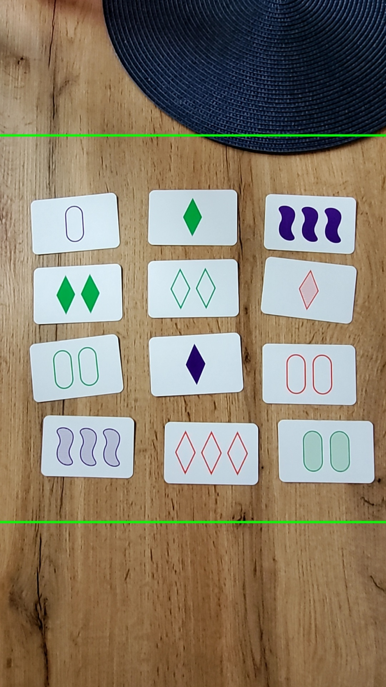
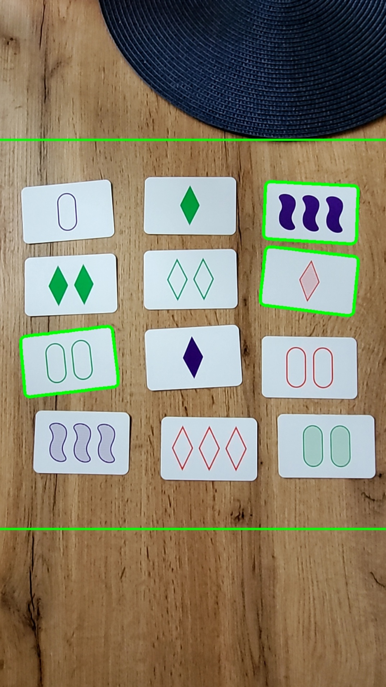
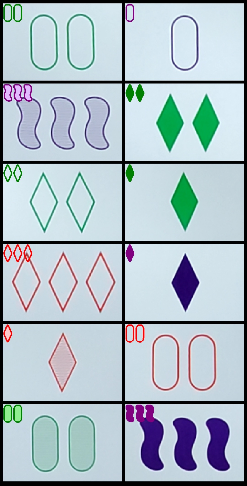
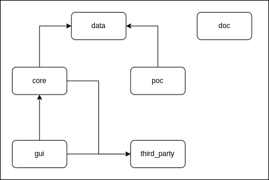
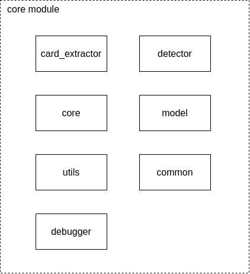
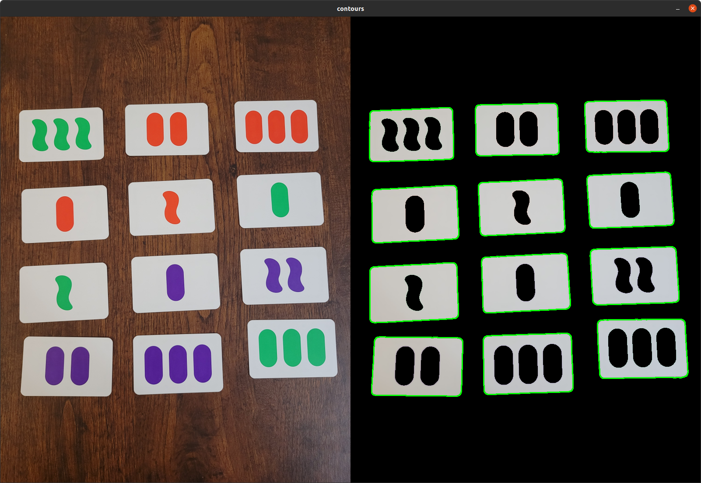
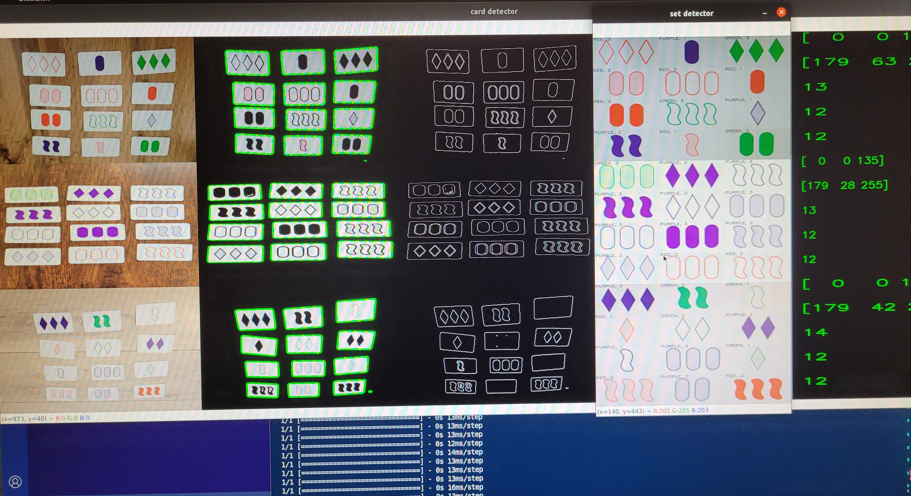

# Set Finder

Have you ever played the card game **Set**? Have you wondered if a 'set' can be found but you just can't see it? The Set Finder application will help you to dispel all your doubts.

## Application
The **Set Finder** is an Android application that finds a set among the cards. It processes a camera stream and draws contours
around the card sets if they exist.

In this repository you can find the first working version of the application. New features, improvments, optimizations and more tests are planned to be done. Current version contains two modes: normal and debug. Use long click to change the mode.

### Normal mode
On the left we have a screenshot, that shows the cards that are processed by the application. Once the set is found, the green contours are drawn (right screenshot).

    
    

### Debug mode
In the debug mode, the input frame is the same as in the normal mode, however it doesn't find sets. Instead, it displays the 'guts' of the application - what cards are extracted and how the features are detected.

In the following case, all cards from the input frame were extracted correctly and all detected features match with the symbols on each card.

    
    

# Architecture
## Overview
The following snippet shows a general overview of the project architecture.

Data - contains images used to test **poc** and **core** modules as well as to train a neural network for color detection. It also contains the generated color models.

Poc - prove of concept written in Python3. It finds sets by using a camera stream from a camera connected to a computer.

Core - module that implements **poc** in C++20. It works as a standalone (similar to the poc by the way of using a camera connected to a computer) or it can be used by other modules like **gui** from this project.

Gui - currently an Android application that uses the **core** module to process a camera stream from a smartphone.

Third party - there are three third party libraries used in the project. **Frugally-deep** allows you to run a prediction on the model that was learned in Python from the C++ code. Then, **bin2cpp** library is used to embed the model into the binary. **Libyuv** converts the Android YUV frames to ARGB format.

Doc - for now just images and sources used to write **README.md**. In the future it will contain the descriptions of the algorithms used in the application.

## Core
### Overview
The core module is a library which can be used standalone as well as linked to a client. The goal was to write a library in a modern C++ style with a clean architecture. To be compliant with C++ Core Guidelines and clean code rules, static-analyzer and format tools are used throughout the implementation.

The core library contains six targets. Each target has a unique responsibility.

The project implements main.cpp that offers to use core library with a camera connected to the computer. Besides, a few debugging options are implemented to easily check how each algorithm works, e.g.:

### Technologies
- docker
- c++20
- openCV
- cmake
- gtest
- clang-tidy
- cppcheck
- clang-format
- cmake-format
- bash

## Poc
### Overview
My main goal of implementing poc was to get familliar with image processing algorithms and machine learning. After I got a 'working' version, I decided to reimplement the poc (python) in c++ (core module). Currently, the poc is no longer maintained and algorithms between poc and core modules started to differ. Nevertheless, poc provides some functionalities like teaching a convolutional neural network and generating test data that make the module still very useful.

### Technologies
- docker
- python3
- openCV
- keras (machine learning)
- pytest

## Gui
### Overview
Currently, gui module is implemented based on [NdkCamera](https://github.com/android/ndk-samples/tree/main/camera) example. The main changes were encapsulated in the PreviewProcessor class. The class provides a callback, which is called when a new frame from the camera is available. Each frame is converted from YUV to ARGB format and processed by the **core** module.

### Technologies
- docker
- c++17
- java
- android ndk
- android sdk
- cmake

